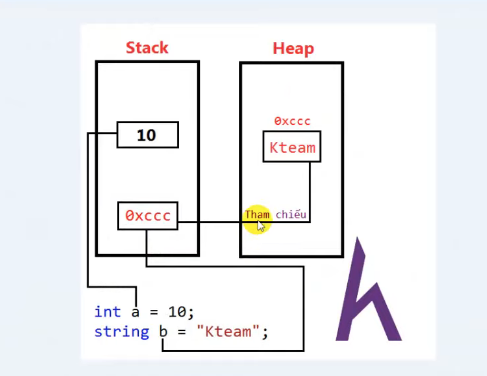
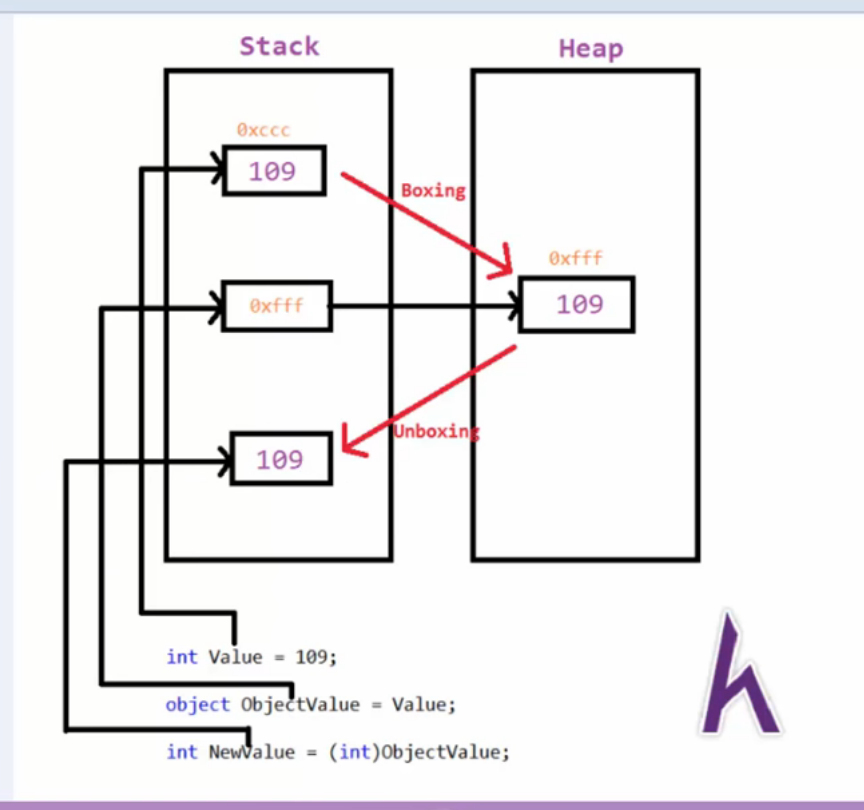

1. if defined type data = int -->> save value saved at [Stack]
2. eg: string b = 'hello' ---> on the [stack] is saved by encryption (hexa 16) and real value saved at [Heap][reference]
   `[Stack] run when programme enforcement , fix [memory]`
   `[Heap] used dynamic allocation, dynamic memory when out of memory`
3. ##Vocab:
   - [garbage collection (GC)]
   - [boxing]: move value data type to reference data type !
     
4. char = '', string = "",if you set value = null ---> int? a = null
5. long - int - bye don't have type null
6. constant ---> const int x = 10;
7. [dynamic] type defined programme compile

## type Variable

| **Type**  | **Type** | **Size** |
| --------- | -------- | -------- |
| INTERGER  | byte     | 1        |
| INTERGER  | short    | 2        |
| INTERGER  | int      | 4        |
| INTERGER  | long     | 8        |
| R-Number  | float    | 4        |
| R-Number  | double   | 8        |
| Character | char     | 2 'char' |

| **Operator** | **Meaning**             |
| ------------ | ----------------------- |
| sizeof()     | show [size] of type     |
| typeof()     | show [type] of variable |
| as           | [constraint] data type  |
